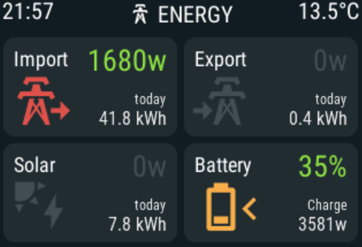

# ha-esp32-dashboard

This is the example of the dashboard that I made to see my solar production and house consumption on Waveshare 7 [ESP32-S3-Touch-LCD-7](https://www.waveshare.com/esp32-s3-touch-lcd-7.htm?sku=27078) 
The case for the display is 3D printed based on [Sergey Morozov design](https://www.printables.com/model/1030369-waveshare-esp32-s3-7inch-capacitive-touch-display/files) 

 

The color are bit off and on real display they look like this a sample image   
 
The icons change color if the production/consumption from the category is active to help indicating what is being used to power the house loads. 

 

The Waveshare 7 inch display config is based on the work of [DMonkey-hub](https://github.com/DMonkey-hub/esphome/blob/main/README.md) 
